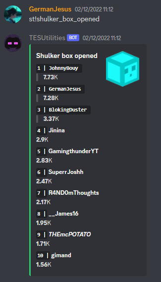
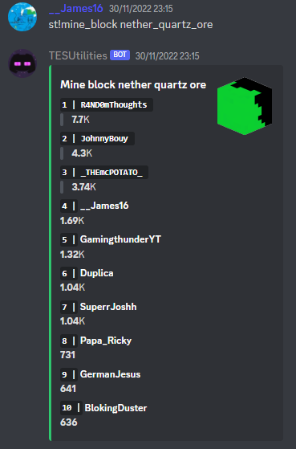
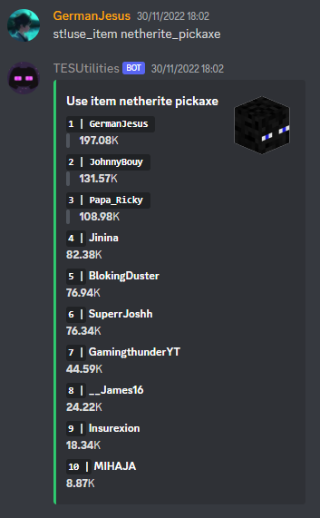
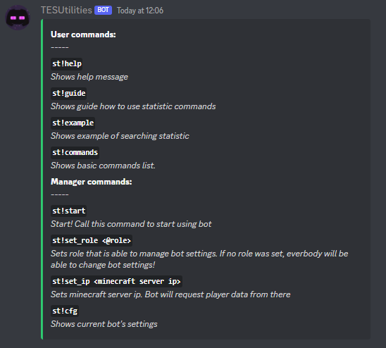
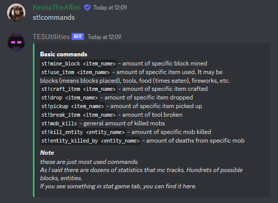
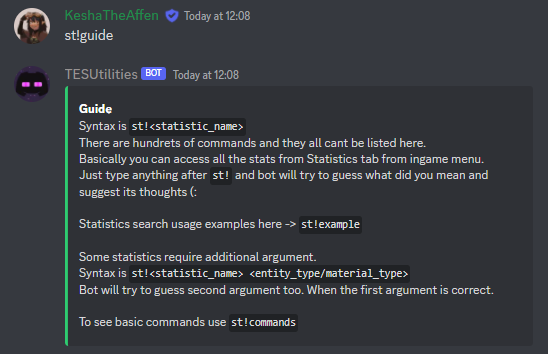

# StatsMC

## Table of Contents
1. [Introduction](#introduction)
2. [Examples](#examples)
3. [Installation Instructions](#installation-instructions)
4. [Bot commands](#commands)

<a name="introduction"></a>

## Intruduction
### StatsMC is a discord bot, that allows you to access minecraft vanilla statistics with commands right inside your discord server. **It requires [StatsMC plugin](https://github.com/Affenmilchmann/StatsMC-plugin) to be installed on the minecraft server!**

### Plugin API entry points documentation is written in plugin repository's [readme](https://github.com/Affenmilchmann/StatsMC-plugin#readme)

<a name="examples"></a>

>## Examples:
<div style="display:flex; flex-flow:row wrap;">
  
  
  
  
</div>

<a name="installation-instructions"></a>

>## Setting up
1) Clone the repository
2) Create `aftoken.py` file and paste there your bot's token.
3) Run `main.py`

Here is fast linux example :
```
git clone https://github.com/Affenmilchmann/StatsMC
cd StatsMC
echo "YOUR_BOT_TOKEN" >> aftoken.py
python3 main.py
```

<a name="commands"></a>

## Bot commands

<div style="display:flex; flex-flow:row wrap;">
  
  
  
</div>
